# Payments — Real-Time Feature Store, Serving & Benchmark

A **real, deployable, benchmarkable** version of a real-time payment-authorization scoring
system on Databricks. It turns an architecture *sample pack* (schema shapes + latency
targets, no running infra) into a working pipeline:

```
seed events → declare features → publish online (Lakebase) → train LightGBM
            → serve with automatic feature lookup → benchmark latency
```

A **Databricks App** walks a transaction through the architecture and **times each stage**,
rendering one latency gauge per component: **1 Read** (Kafka) → **2 Inference** (serving
endpoint, which does the online **feature lookup itself via the Feature Engineering API**) →
**3 Write back** (Kafka). It uses an in-app Kafka broker when one is reachable and an
in-process queue otherwise (the Apps container ships no Kafka binary), so the Read/Write
stages are always exercised; the inference + feature-lookup stage is always real. The app
never touches the online store directly — reads go through the Feature Engineering API inside
the endpoint. **All data is synthetic and all names are generic** — this is a pattern
reference, not tied to any company.

## Architecture



Diagrams are authored in [**D2**](https://d2lang.com) — the `.d2` sources are the
version-controllable, editable artifacts; rendered `.svg`s are committed alongside. See
[`docs/architecture/`](docs/architecture/): `01_solution`, `02_feature_topology`
(feature topology, cache feed-forward & cadence tiers), `03_latency_path` (request-time
sequence), and `04_kafka_realtime` (Kafka consume → score → produce). Re-render with
`d2 <file>.d2 <file>.svg`.

## What maps to what

| Goal | Where |
|------|-------|
| Seed a table | `01_seed_data.py` → `<catalog>.payments.raw_events` |
| Declare features (Feature Engineering API) | `02_feature_engineering.py` — `FeatureEngineeringClient`, `FeatureLookup`, `FeatureFunction` |
| Online serving (Lakebase) | `03_online_store.py` — `fe.create_online_store` + `fe.publish_table` |
| LightGBM (section-4 pipeline) | `04_train_register.py` — training set + `fe.log_model` |
| Serve + auto feature lookup | `05_serving.py` |
| Profile online performance | `06_benchmark.py` — p50/p90/p99, throughput |
| Cache daily/monthly + feed forward | `02` (initial) + `08_backfill_cache.py` (scheduled) |
| Hot 1h counters (5-min batch or 30-s loop) | `07_streaming_counters.py` (`mode` widget) |
| Kafka consume → score → produce | `09_kafka_io.py` |
| Per-stage latency walk (read → Lakebase → inference → write back) | `app/` (FastAPI Databricks App) |
| Feature freshness KPI (P10/50/90/99) | `10_freshness_kpi.py` |

### The app: a live latency walk
The `app/` Databricks App is the narrative front-end. It walks a single payment authorization
through the **same path as `03_latency_path`** and times each hop, so you can see where the
milliseconds actually go:

1. **Read** — consume the transaction from the Kafka topic (the event bus).
2. **Inference** — call the model serving endpoint; it looks up the online features **itself
   via the Feature Engineering API** (the model was logged with `fe.log_model`, so automatic
   feature lookup happens inside the endpoint) and returns block/pass.
3. **Write back** — publish the decision to the outbound Kafka topic.

The feature-store read lives **inside** stage 2 — the app never talks to the online store
directly, exactly as a production scorer would go through the endpoint. The dashboard shows
one gauge per stage (p50 headline, p99 sub-line, bar scaled to the slowest stage) plus
end-to-end totals. **Start stream** runs a continuous flow; **Score one** walks a single
transaction and prints its per-stage breakdown. The first request is slow (the serving
endpoint cold-starts), so the numbers settle after a few seconds.

> **Transport caveat (honest):** the **inference + feature-lookup stage is always real**. The
> Read/Write stages use a real Kafka broker only if one is reachable; inside the Databricks
> Apps container there is no Kafka binary, so they fall back to an **in-process queue** and the
> UI says so. A real Kafka broker over the network is exercised by `09_kafka_io`, and
> `/kafka_probe` (creds from a secret scope, nothing echoed back) tests whether the app can
> reach an external managed broker.

### Caching & "feed forward"
Daily and monthly aggregates are stored in feature tables with a **timeseries column** set
to the *end* of each period. A point-in-time lookup (`timestamp_lookup_key=event_ts`) returns
the most recent **completed** period and carries it forward until the next scheduled refresh —
correct for both training (no leakage) and serving. `08_backfill_cache` recomputes and
re-publishes these on a cron (or on demand from the App's `/backfill`).

### Current vs legacy APIs
Uses `databricks-feature-engineering` → `FeatureEngineeringClient` and the **Lakebase Online
Feature Store** (`create_online_store` / `publish_table`). It deliberately avoids the legacy
`FeatureStoreClient` and `OnlineTableSpec`/online tables (no longer supported), and replaces
the original sample's external Redis hot-cache with Lakebase.

## Three architecture patterns

The sample demonstrates three patterns for real-time payment scoring. Two latency axes are
kept distinct throughout: **freshness** (how stale a feature is when scored) and **decision
latency** (how fast the block/pass round-trip is).

### 1 · 30-second burst features through Lakebase (vs Spark Real-Time Mode)

They run through Lakebase — **no RTM needed for a 30-second refresh**. `07_streaming_counters`
runs the same full-universe recompute in two modes via a `mode` widget: `batch` (one refresh
per run, scheduled on a 5-min cron) and `loop` (a **30-second driver-side loop**, re-publishing
to Lakebase each tick). It is a driver loop, not streaming `foreachBatch`: the FE publish APIs
are driver-side and need the notebook's auth, which a serverless Spark Connect `foreachBatch`
worker doesn't have (see `07`'s header). For a truly incremental aggregation, stream from Kafka
into a Delta feature table and let Lakebase **`CONTINUOUS`** publish auto-sync it (~10–20 s,
~15-s minimum) — see `09_kafka_io`. Reach for **RTM** (~5 ms floor, dedicated slots) only when
a *feature* or the *per-transaction decision* must be sub-second.

### 2 · Mixed refresh frequencies (monthly → 30 s) and compute per tier

Each feature table publishes independently into **one** Lakebase online store, and the
model's `FeatureLookup` set assembles across all of them at serving time. Pick the cheapest
compute per tier:

| Tier | Cadence | Compute | Publish to Lakebase | Notebook |
|------|---------|---------|---------------------|----------|
| Profile / monthly / weekly | scheduled | serverless job (or Lakeflow pipeline, triggered) | `TRIGGERED` snapshot | `08` |
| Daily / hourly | scheduled | serverless job (triggered) | `TRIGGERED` | `08` |
| **30-second burst** | 30-s loop or stream | serverless job (`07` in `loop` mode), or serverless streaming from Kafka; RTM only if sub-second | `TRIGGERED` each tick (or `CONTINUOUS` for a stream) | `07` / `09` |

Prefer serverless + triggered everywhere you can (pay per run, minute granularity); an
always-on classic cluster is justified only for sub-second RTM when serverless RTM isn't an
option. One Lakebase Autoscaling store absorbs every cadence; size Capacity Units to read QPS.

### 3 · Kafka integration (consume transactions, write results back)

`09_kafka_io.py` shows the full shape: `readStream.format("kafka")` (UC service credential /
mTLS / SASL / MSK IAM auth variants) → assemble features → `foreachBatch` scores against the
serving endpoint → `writeStream.format("kafka")` produces decisions to the outbound topic. It
also sketches the **Streaming Declarative Features** preview alternative (Kafka → serverless
SDP → Lakebase, `create_feature`, p95 <0.5 s; JSON only at launch, Count/Avg/Sum/StddevPop
aggregations, rolling windows ≤ 1 week). For on-prem or PCI-scoped brokers, networking
(NCC/PrivateLink for serverless, VPC peering for classic) and the added round-trip often gate
the architecture — measure it early. See `docs/architecture/04_kafka_realtime`.

### Measuring freshness (the KPI behind Q1)

`10_freshness_kpi.py` quantifies the Q1 freshness claim **through the Feature Engineering API
only** — no direct Lakebase access. A sub-second batch generator appends events to Delta (each
stamped `event_ts`), a driver-side loop aggregates them and calls `fe.write_table` +
`fe.publish_table(TRIGGERED)`; because `publish_table` blocks until the online sync completes,
its return marks the online-readable moment. It reports the **P10/P50/P90/P99** of freshness =
`(publish-return time) − (event_ts)` to `…payments.freshness_kpi`. On the FEVM at 200 rows/s
with a 1-s tick, **P50 ≈ 11.6 s** — because `publish_table(TRIGGERED)` spins up a sync run each
call, adding seconds of fixed overhead per publish. That is the honest cost of the
**triggered-publish** path and the right number for a batch/triggered cadence; for genuinely
low-latency freshness use a **continuous** publish so the sync is always-on rather than
per-tick (the same batch-vs-continuous tradeoff as the 30-second counter path in `07`). The
harness makes that cost measurable — point it at your candidate publish mode and read the
percentiles. (On serverless it uses a driver-side batch-append generator rather than a
background rate-source stream — Spark Connect restricts a background `writeStream` running
alongside a driver polling loop in one process.)

## Deploy & run

Prereqs: Databricks CLI ≥ 0.265.0 (you have a newer one), a workspace with **Lakebase
(Autoscaling)** and **Databricks Apps** in-region, and DBR 16.4 LTS ML+ / serverless. The
bundle is part of the repo root `databricks.yml` (target `dev`, profile `DEFAULT`).

```bash
# 1. Validate (set the catalog for your workspace)
databricks bundle validate -t dev --var="payments_catalog=<catalog>"

# 2. Deploy
databricks bundle deploy -t dev --var="payments_catalog=<catalog>"

# 3. Run the full pipeline (seed → features → online → train → serve → benchmark)
databricks bundle run payments_setup_and_train -t dev

# 4. (optional) run the hot-counter refresh / cache backfill on demand
databricks bundle run payments_counters_refresh -t dev      # 5-min batch (scheduled every 5 min)
databricks bundle run payments_counters_refresh_rt -t dev   # 30-s hot path (07 in loop mode)
databricks bundle run payments_backfill_cache -t dev
```

The App (`payments-feature-store-demo`) deploys with the bundle (with a `database` resource
for the direct Lakebase lookup). Open it, click **Start stream** or **Score one**, and watch
the per-stage latency gauges update live (read → Lakebase → inference → write back).

## Benchmark vs sample targets

`06_benchmark.py` writes results to `shm_skunkworks_catalog.payments.benchmark_results`. Compare against the
original sample's per-component targets:

| Component | Sample target |
|-----------|---------------|
| Feature Store (online) read | p50 ~3ms · p99 ~8ms |
| Model inference | p50 ~2ms · p99 ~5ms |
| **End-to-end scoring** | **p99 < 50ms** |

(Real numbers depend on workload size, scale-to-zero warm-up, and region; the benchmark
warms the endpoint before measuring.)

## Notebooks
`00_setup` (shared constants) · `01_seed_data` · `02_feature_engineering` · `03_online_store`
· `04_train_register` · `05_serving` · `06_benchmark` · `07_streaming_counters` (5-min batch
or 30-s loop, via `mode`) · `08_backfill_cache` · `09_kafka_io` (Kafka consume → score →
produce) · `10_freshness_kpi` (P10/50/90/99 feature freshness).
